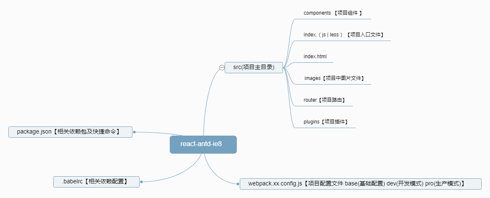

期望来star … ^_^ …

兼容性 ie >= 8;

本 demo 依赖 webpack + react + react-router-dom + antd + less;

这只是一个兼容 ie8 的测试 demo 如要用于真正项目开发还需完善配置;

执行以下命令运行demo:

	npm install (安装相关依赖包)

	npm start (运行项目)

	npm run build (生产模式构建)

项目结构图：
　　　
　　　
	
	
	
	